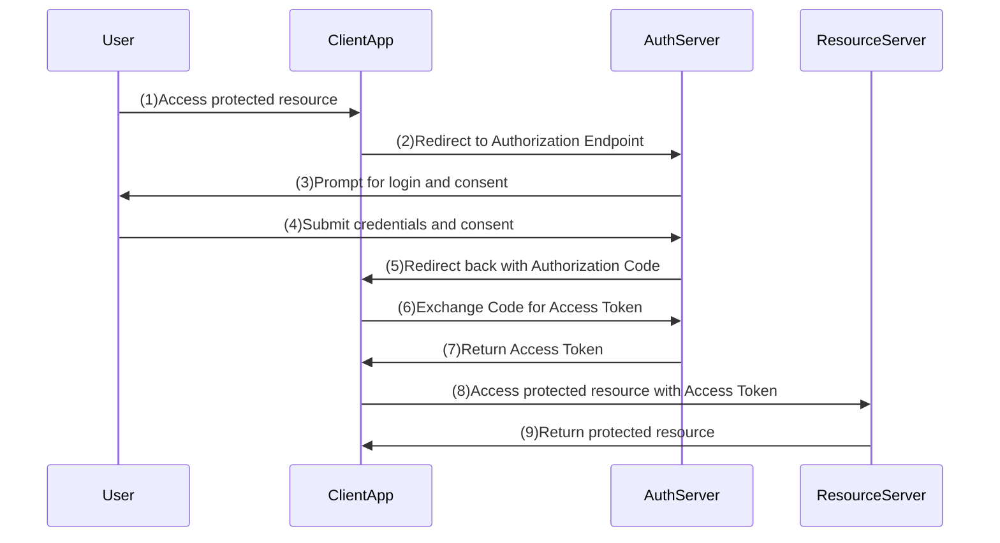

# Authorization Code Flow with PKCE Example

This example demonstrates an OAuth2 Authorization Code Flow with PKCE using Keycloak as the OAuth2 provider, a simple resource server, and a React client application.

This is not a production-ready setup. It is intended for educational purposes to illustrate the OAuth2 Authorization Code Flow with PKCE.

Public clients (like single-page applications) cannot securely store client secrets. Therefore, they use PKCE (Proof Key for Code Exchange) to enhance the security of the Authorization Code Flow by mitigating authorization code interception attacks.

## Sequence Diagram



## OAuth2 Provider Setup

### Start the OAuth2 Provider with pre-configured realm

- Inspect the realm: `authorization-code-flow/oauth2-provider/imports/realm.json`
- Client ID provided: `oauth2-playbook-auth-code-pkce` (Authorization Code + PKCE).
- Remember the clientId, that you've to set during client app configuration.

```bash
#remove any existing containers related to keycloak
docker rm $(docker ps -a -q --filter name=keycloak) 2>/dev/null || true

#start the oauth2 provider
cd ./authorization-code-flow/oauth2-provider
./start.sh
```

### Keycloak Admin Console

 - [https://localhost:9443/](https://localhost:9443/) `admin/admin`

## Resource Server

### Start and Verify Resource Server

- Verify CORS settings in the resource server to allow requests from the client app (for example, `https://localhost:3000`).
- In a new terminal, run the resource server setup script to generate self-signed certs and start the server:
- Verify `src/main/resources/application.properties` to ensure it matches the OAuth2 provider settings.

```shell
./authorization-code-flow/setup-resource-server.sh
```

(Or) if you want to create it from scratch use the [Create Resource Server](../docs/resource-server-creation.md) instructions.


### Resource Server Health Check

- Verify the resource server is running: [https://localhost:8443/q/health](https://localhost:8443/q/health)


## Client Application Setup

### Create React App Skeleton

If you don't already have the client app, create it and add required packages:

```bash
cd ./authorization-code-flow
npx create-react-app client
cd client
npm install react-router-dom oidc-client-ts
```

### Add authConfig in the Client App

- Create a new folder `src/auth`
- Add `authConfig.js` and `authService.js` files based on the examples in this repo.
- Create a new folder `src/pages` and add `Home.js` and `Callback.js` pages based on the examples in this repo.
- Modify `src/App.js` to include routing to the above pages.

### Run the Client Application

Start the dev server with HTTPS enabled (recommended for OIDC flows):

Note: Before you launch the client app, ensure that the OAuth2 provider and resource server are running, you must load following URL in browser to accept the self-signed certificate used by the React app:

- Keycloak [well-known](https://localhost:9443/realms/oauth2-playbook/.well-known/openid-configuration)
- Load Resource Server [health endpoint](https://localhost:8443/q/health)

Then run

```bash
cd ./authorization-code-flow/client
#demo/demo123
export HTTPS=true && npm start
```

Notes:
- The React app includes a `Callback` page at `/callback` — ensure the provider redirect URI matches the app (for example `https://localhost:3000/callback`).
- Use the realm import file above to review clients, scopes and roles if you need to adjust the Keycloak configuration.