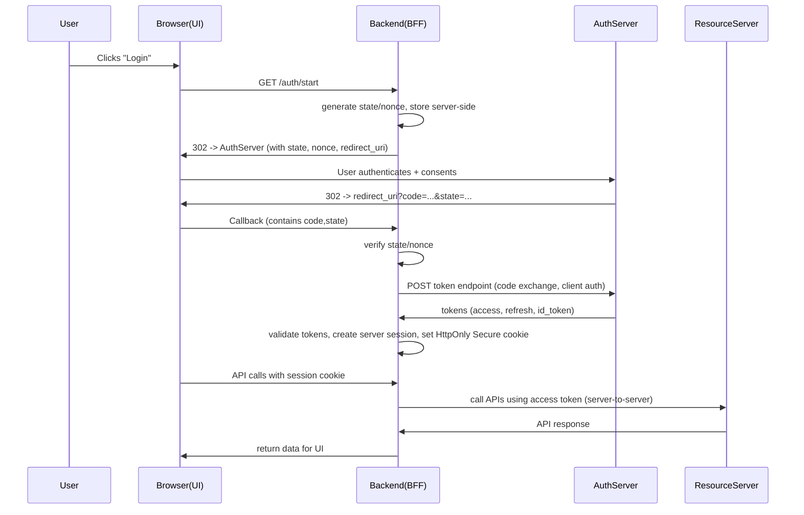

# Confidential Client -  authorization code flow + PKCE

BFF Authorization Code Flow (Backends for Frontends)

This is not a production-ready setup. It is intended for educational purposes to illustrate the OAuth2 Authorization Code Flow is achievable in back channel.

Backend clients (also known as confidential clients) can securely store client credentials (like client secret) and are capable of maintaining the confidentiality of these credentials. Therefore, they can perform the OAuth2 Authorization Code Flow without exposing sensitive information to the end-user's browser or front-end application.

## Sequence Diagram

