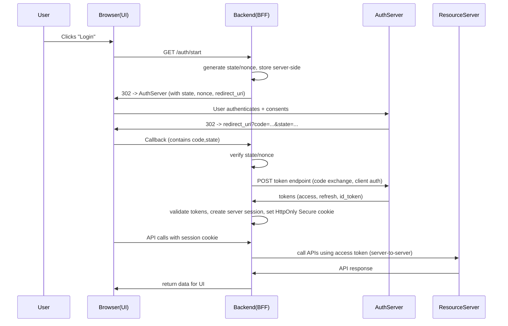

# Confidential Client -  authorization code flow + PKCE

BFF Authorization Code Flow (Backends for Frontends)

This is not a production-ready setup. It is intended for educational purposes to illustrate the OAuth2 Authorization Code Flow is achievable in back channel.

Backend clients (also known as confidential clients) can securely store client credentials (like client secret) and are capable of maintaining the confidentiality of these credentials. Therefore, they can perform the OAuth2 Authorization Code Flow without exposing sensitive information to the end-user's browser or front-end application.

## Sequence Diagram


```mermaid
sequenceDiagram
  participant User
  participant Browser(UI)
  participant Backend(BFF)
  participant AuthServer
  participant ResourceServer

  User->>Browser(UI): Clicks "Login"
  Browser(UI)->>Backend(BFF): GET /auth/start
  Backend(BFF)->>Backend(BFF): generate state/nonce, store server-side
  Backend(BFF)->>Browser(UI): 302 -> AuthServer (with state, nonce, redirect_uri)
  Browser(UI)->>AuthServer: User authenticates + consents
  AuthServer->>Browser(UI): 302 -> redirect_uri?code=...&state=...
  Browser(UI)->>Backend(BFF): Callback (contains code,state)
  Backend(BFF)->>Backend(BFF): verify state/nonce
  Backend(BFF)->>AuthServer: POST token endpoint (code exchange, client auth)
  AuthServer->>Backend(BFF): tokens (access, refresh, id_token)
  Backend(BFF)->>Backend(BFF): validate tokens, create server session, set HttpOnly Secure cookie
  Browser(UI)->>Backend(BFF): API calls with session cookie
  Backend(BFF)->>ResourceServer: call APIs using access token (server-to-server)
  ResourceServer->>Backend(BFF): API response
  Backend(BFF)->>Browser(UI): return data for UI
```

## Pre-requisites

- Java 17+ (for the resource server example)
- Node.js 16+ (for the React client example)
- Docker (for running Keycloak locally)
- OpenSSL (for generating self-signed certs for the resource server)

## Setup and Run

### Start the OAuth2 Provider with pre-configured realm

- Inspect the realm: `bff-authorization-code-flow/oauth2-provider/imports/realm.json`
- Client ID provided: `oauth2-playbook-auth-code-bff-pkce` (Authorization Code + PKCE).
- Start the provider:

```bash
  cd ./bff-authorization-code-flow
  ./oauth2-provider/start.sh
```

### Start the Backend for Frontend (BFF) Resource Server

- Verify the `application.properties` in the BFF Quarkus app to ensure it matches the OAuth2 provider settings (client ID, auth server URL, etc).
- Run the BFF resource server with TLS enabled (using the self-signed certs):

```bash
cd ./bff-authorization-code-flow
./start-bff-app.sh
```

Few important `application.properties` settings to note:

```properties
#HTTP & SSL
quarkus.http.ssl-port=8443
quarkus.http.port=8443
quarkus.http.insecure-requests=disabled
quarkus.http.ssl.certificate.key-files=key.pem
quarkus.http.ssl.certificate.files=cert.pem
quarkus.http.ssl.certificate.key-store-file-type=PEM
quarkus.oidc.tls.verification=none

# CORS (Keep only if frontend is on a different port/domain)
quarkus.http.cors.enabled=true
quarkus.http.cors.origins=https://localhost:3000
quarkus.http.cors.methods=GET,POST,PUT,DELETE,OPTIONS
quarkus.http.cors.access-control-allow-credentials=true
quarkus.http.cors.exposed-headers=Content-Disposition


# OIDC Core (Authorization Code Flow + PKCE in BFF)
quarkus.oidc.auth-server-url=https://localhost:9443/realms/oauth2-playbook
quarkus.oidc.client-id=oauth2-playbook-auth-code-bff-pkce
quarkus.oidc.credentials.secret=secret

quarkus.oidc.application-type=web-app
quarkus.oidc.authentication.pkce-required=true
quarkus.oidc.authentication.scopes=profile users:read
quarkus.oidc.authentication.cookie-path=/
quarkus.oidc.authentication.cookie-same-site=lax
quarkus.oidc.authentication.restore-path-after-redirect=true
quarkus.oidc.authentication.java-script-auto-redirect=false

quarkus.oidc.logout.post-logout-path=https://localhost:3000
quarkus.oidc.logout.path=/logout


# Token Management (store all tokens in encrypted session cookie)
quarkus.oidc.token-state-manager.strategy=keep-all-tokens
quarkus.oidc.token-state-manager.encryption-secret=<super-secret-encryption-key>

quarkus.http.auth.permission.health.paths=/q/health/*
quarkus.http.auth.permission.health.policy=permit
quarkus.http.auth.permission.login.paths=/login
quarkus.http.auth.permission.login.policy=authenticated


# Resource Client
quarkus.rest-client.resource-api.url=https://localhost:15443
quarkus.rest-client.resource-api.trust-all=true
quarkus.tls.trust-all=true
```

### Resource Server Setup

- Set right token audience (aud) in application.properties to match the provider configuration (for example, `oauth2-playbook-resource-server`).
- Start the resource server with TLS enabled (using the self-signed certs):

```bash
cd ./bff-authorization-code-flow
./start-resource-server.sh
```

```properties
# Enable OIDC / JWT validation
quarkus.oidc.enabled=true

quarkus.http.ssl-port=15443
quarkus.http.insecure-requests=disabled
quarkus.http.ssl.certificate.key-files=key.pem
quarkus.http.ssl.certificate.key-store-file-type=PEM
quarkus.http.ssl.certificate.files=cert.pem

quarkus.http.auth.permission.secured.paths=/api/*
quarkus.http.auth.permission.secured.policy=authenticated

# Deprecated
quarkus.oidc.tls.verification=none
quarkus.oidc.tls.trust-all=true

quarkus.oidc.auth-server-url=https://localhost:9443/realms/oauth2-playbook
quarkus.oidc.client-id=oauth2-playbook-resource-server
quarkus.oidc.token.audience=oauth2-playbook-resource-server
quarkus.oidc.tenant-enabled=true
```

### Start Client Application

- Follow the instructions in `bff-authorization-code-flow/client/README.md` to set up and run the React client application.

## Notes

Modern browsers does not allow self-signed certificates by default. To run the client app with HTTPS locally, you need to load the self-signed certs in your browser and accept the risks for local development.