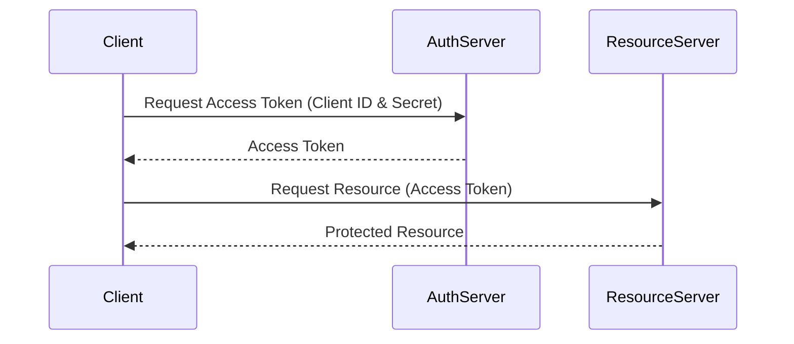

# Client Credentials Flow

This directory contains an example implementation of the OAuth 2.0 Client Credentials Flow. This flow is typically used for server-to-server authentication, where a client application needs to access resources on behalf of itself rather than on behalf of a user.

## Overview

In the Client Credentials Flow, the client application authenticates itself directly with the authorization server using its client ID and client secret. Upon successful authentication, the authorization server issues an access token that the client can use to access protected resources.

## Implementation

The implementation in this directory includes:

- A sample client application that requests an access token using the Client Credentials Flow.
- Configuration files for setting up the client credentials.
- Example code snippets demonstrating how to make requests to the authorization server and handle the access token.

## Sequence Diagram



This diagram illustrates the sequence of interactions in the Client Credentials Flow.

## Getting Started

To get started with the Client Credentials Flow example:

1. Clone the repository to your local machine.
2. Navigate to the `client-credentials-flow` directory.

### Create Self-Signed Certificates for mTLS

The script below does the following:

- Creates self-signed certificates for the client to use for mTLS authentication with Keycloak.
- Creates a truststore.jks file using keytool and imports client certificate alias into it.
- Copies the truststore.jks file to the oauth2-provider directory for Keycloak to use.

```shell
cd client

#the below creates self-signed certs for mTLS client, and creates truststore for keycloak
./setup.sh
```

### Start the OAuth2 Provider

```shell
#remove any existing containers related to keycloak
docker rm $(docker ps -a -q --filter name=keycloak) 2>/dev/null || true

cd ../oauth2-provider
./start.sh
```

### Start the Resource Server

```shell
./client-credentials-flow/setup-resource-server.sh
```

(Or) if you want to create it from scratch use the [Create Resource Server](../docs/resource-server-creation.md) instructions.


### Test the Client Credentials Flow

- Run the client application to request an access token using the Client Credentials Flow with mTLS.
- The script does the following steps:
    1. Generate the admin token to interact with Keycloak Admin API.
    2. Assign the `oauth2-playbook-readonly` realm role to the service account user of the client.
    3. Request an access token using client credentials (MTLS).
    4. Invokes the protected resource endpoint using the obtained access token.

```shell
cd ../client
./start.sh
```

## When to use Client Credentials Grant

The Client Credentials Grant is typically used in scenarios where the client application needs to access resources that are not associated with a specific user. Common use cases include:
    - Machine-to-machine communication, such as microservices interacting with each other.
    - Backend services that need to access APIs on behalf of themselves rather than on behalf of a user.
    - Automated processes or scheduled tasks that require access to protected resources.
    - It is important to note that the Client Credentials Grant should only be used by trusted clients, as it involves the use of client credentials (client ID and client secret) for authentication.