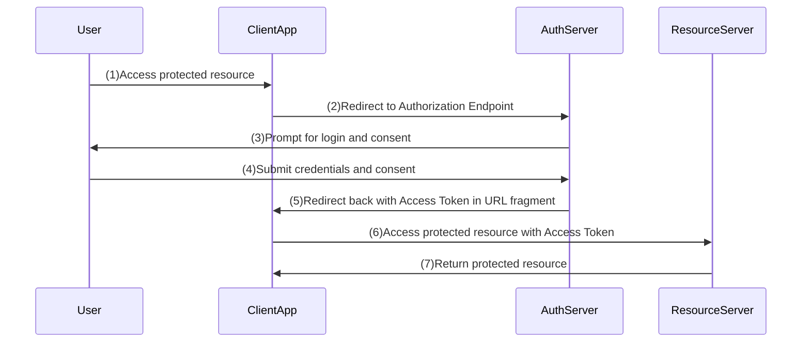

# Implicit Flow

This is not a production-ready setup. It is intended for educational purposes to illustrate the OAuth2 Implicit Flow.

This is not a recommended flow for modern applications due to security concerns and the availability of more secure alternatives like the Authorization Code Flow with PKCE.

## Sequence Diagram

*This grant type implementation is not yet completed in oauth2-playbook*.
