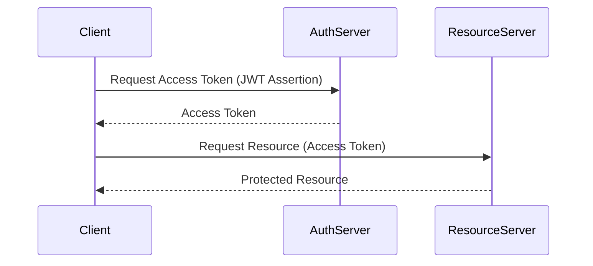

# Jwt Bearer token grant type

This is not a production-ready setup. It is intended for educational purposes to illustrate the OAuth2 JWT Bearer Token Grant Type.

## Sequence Diagram

This diagram illustrates the sequence of interactions in the JWT Bearer Token Grant Type.

*This grant type implementation is not yet completed in oauth2-playbook*.