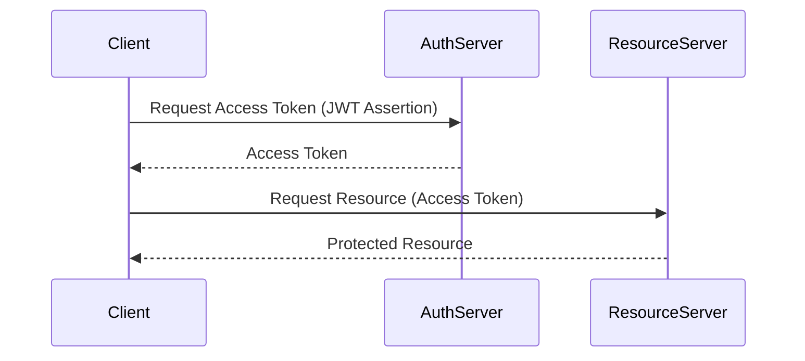

# Jwt Bearer token grant type

This is not a production-ready setup. It is intended for educational purposes to illustrate the OAuth2 JWT Bearer Token Grant Type.

## Sequence Diagram

This diagram illustrates the sequence of interactions in the JWT Bearer Token Grant Type.

*This grant type implementation is not yet completed in oauth2-playbook*.

## When to use JWT Bearer Token Grant

The JWT Bearer Token Grant Type is typically used in scenarios where:

- the client application needs to authenticate using a JWT assertion, which can include claims about the client and its permissions.
- there is a need for stateless authentication, as JWTs can be self-contained and do not require server-side session storage.

However, it is generally recommended to use more common grant types like the Authorization Code Flow with PKCE or Client Credentials Flow for most use cases, as they provide better security and flexibility. The JWT Bearer Token Grant Type may be considered in specific scenarios where its advantages align with the application's requirements.