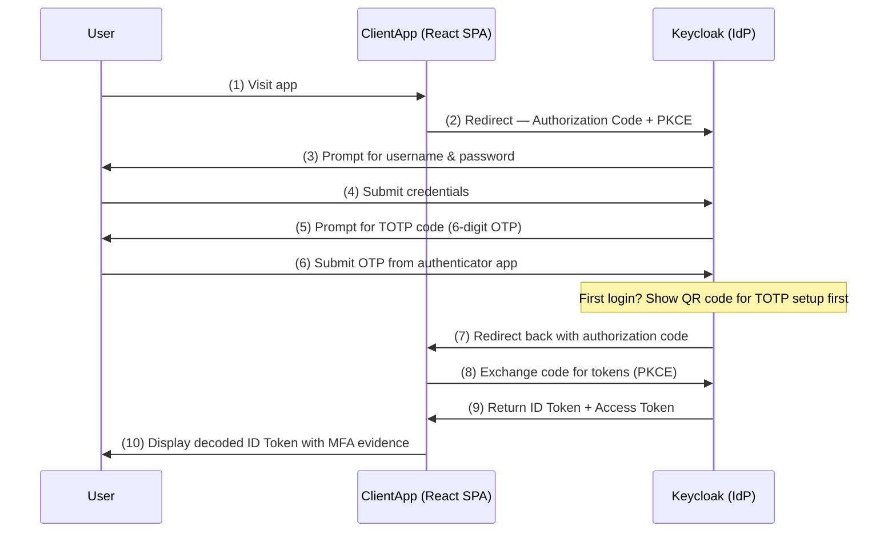

# Multi-Factor Authentication (MFA) with Keycloak — Password + TOTP

This scenario demonstrates how to configure **multi-factor authentication** using Keycloak as the identity provider. The user must authenticate with both a **password** (something they know) and a **time-based one-time password — TOTP** (something they have via an authenticator app).

After login the React client decodes the ID Token and shows the claims that prove the user went through MFA.

> This is not a production-ready setup. It is intended for educational purposes to illustrate MFA configuration with Keycloak.

## Sequence Diagram



## How MFA Works in This Setup

| Factor | Type | Implementation |
|--------|------|----------------|
| **1st factor — Password** | Something you know | Standard Keycloak username/password form |
| **2nd factor — TOTP** | Something you have | 6-digit code from an authenticator app (Google Authenticator, FreeOTP, Authy, etc.) |

Keycloak's **browser authentication flow** has been customized (named `mfa-browser`) so that the OTP form is **REQUIRED** — not ALTERNATIVE. Every user must complete both factors to obtain tokens.

### Key Realm Configuration

- **`otpPolicy`** — TOTP, HMAC-SHA1, 6 digits, 30-second period (RFC 6238).
- **`authenticationFlows`** — custom `mfa-browser` flow:
  1. Cookie authenticator (ALTERNATIVE) — allows session re-use without re-entering credentials.
  2. `mfa-browser forms` sub-flow (ALTERNATIVE to cookie):
     - `auth-username-password-form` — **REQUIRED**
     - `auth-otp-form` — **REQUIRED**
- **`browserFlow: "mfa-browser"`** — realm-level override pointing to the custom flow.
- **User `demo`** — has `CONFIGURE_TOTP` required action, so the first login forces TOTP setup.

### What Appears in the ID Token

After successful MFA login the ID Token contains (among standard OIDC claims):

| Claim | Example Value | Meaning |
|-------|---------------|---------|
| `acr` | `"1"` | Authentication Context Class Reference — `"1"` means active authentication occurred (not just session cookie). Keycloak defaults to `"1"` for any interactive login. |
| `auth_time` | `1735123456` | UNIX epoch (seconds) when the user last actively authenticated. A recent value confirms MFA just happened. |
| `preferred_username` | `"demo"` | The authenticated user. |
| `sub` | `"<uuid>"` | Unique user identifier. |

> **About the `amr` claim:** The OIDC spec defines `amr` (Authentication Methods References) to list methods like `["pwd", "otp"]`. Keycloak does **not** populate `amr` by default. You can add it via a custom Script Protocol Mapper or a JAR-based mapper — see the "Going Further" section below.

## Structure

```
mfa-authentication/
├── README.md                          ← you are here
├── client/                            ← React SPA (Auth Code + PKCE)
│   ├── package.json
│   ├── public/
│   └── src/
│       ├── auth/
│       │   ├── authConfig.js          ← OIDC client config (client_id, scopes, etc.)
│       │   └── authService.js         ← login / logout / getUser helpers
│       ├── pages/
│       │   ├── Callback.js            ← OIDC redirect callback handler
│       │   └── Home.js                ← Decodes & displays ID Token claims
│       └── App.js
└── oauth2-provider/
    ├── docker-compose.yaml            ← Keycloak container
    ├── start.sh                       ← Generate certs & start Keycloak
    └── imports/
        └── realm.json                 ← Realm with MFA browser flow, OTP policy, demo user
```

## Getting Started

### 1. Start Keycloak (OAuth2 Provider)

```bash
# Remove any previous Keycloak container
docker rm $(docker ps -a -q --filter name=keycloak) 2>/dev/null || true

cd ./mfa-authentication/oauth2-provider
./start.sh
```

Keycloak will start on **https://localhost:9443** and auto-import the realm from `imports/realm.json`.

- Admin console: [https://localhost:9443/](https://localhost:9443/) — `admin / admin`
- Well-known endpoint: [https://localhost:9443/realms/oauth2-playbook/.well-known/openid-configuration](https://localhost:9443/realms/oauth2-playbook/.well-known/openid-configuration)

### 2. Accept the Self-Signed Certificate

Before launching the React app, open the Keycloak well-known URL in your browser and accept the certificate warning:

- [https://localhost:9443/realms/oauth2-playbook/.well-known/openid-configuration](https://localhost:9443/realms/oauth2-playbook/.well-known/openid-configuration)

### 3. Start the React Client

```bash
cd ./mfa-authentication/client
npm install
HTTPS=true npm start
```

The app opens at **https://localhost:3000** and immediately redirects to Keycloak for login.

### 4. First Login — Set Up TOTP

1. Sign in with **`demo`** / **`demo123`**.
2. Keycloak will present a **QR code** — scan it with your authenticator app:
   - [Google Authenticator](https://play.google.com/store/apps/details?id=com.google.android.apps.authenticator2) (Android / iOS)
   - [FreeOTP](https://freeotp.github.io/) (Android / iOS)
   - [Authy](https://authy.com/) (Desktop / Mobile)
   - [Microsoft Authenticator](https://www.microsoft.com/en-us/security/mobile-authenticator-app) (Android / iOS)
3. Enter the **6-digit code** displayed in the authenticator app and click **Submit**.
4. You are now redirected back to the React app with your tokens.

### 5. Inspect the ID Token

The Home page shows:

- **Authentication Context** — `acr`, `amr`, `auth_time` claims with human-readable explanations.
- **User Profile Claims** — name, email, username from the `profile` scope.
- **Full Decoded ID Token** — every claim in the JWT payload.
- **Raw JWT** — copy-paste it into [jwt.io](https://jwt.io) for independent verification.

### 6. Subsequent Logins

Every time the session expires and you log in again, Keycloak will ask for:

1. Username & password
2. The current 6-digit TOTP code from your authenticator app

No way to skip the OTP — it is **REQUIRED** in the authentication flow.

## Keycloak Realm Details

### Client Configuration

| Setting | Value |
|---------|-------|
| Client ID | `oauth2-playbook-mfa` |
| Protocol | OpenID Connect |
| Public client | Yes |
| Standard flow (Auth Code) | Enabled |
| PKCE method | S256 |
| Redirect URI | `https://localhost:3000/callback` |
| Post-logout redirect | `https://localhost:3000` |
| Consent required | No |
| Default scopes | `openid`, `profile`, `basic`, `acr` |

### OTP Policy

| Setting | Value |
|---------|-------|
| Type | TOTP (Time-based) |
| Algorithm | HmacSHA1 |
| Digits | 6 |
| Period | 30 seconds |
| Look-ahead window | 1 |

### Test User

| Field | Value |
|-------|-------|
| Username | `demo` |
| Password | `demo123` |
| Email | `demo@oauth2-playbook.dev` |
| Required actions | `CONFIGURE_TOTP` (first login only) |

## Going Further

### Adding the `amr` Claim

Keycloak does not emit the `amr` (Authentication Methods References) claim by default. To add it you have several options:

1. **Script Protocol Mapper** — enable the `scripts` feature (`--features=scripts` on the Keycloak `start-dev` command) and add a mapper of type `oidc-script-based-protocol-mapper` to the client:

   ```javascript
   // Script body
   var ArrayList = Java.type('java.util.ArrayList');
   var amr = new ArrayList();
   amr.add('pwd');
   amr.add('otp');
   exports = amr;
   ```

   This adds `"amr": ["pwd", "otp"]` to the ID Token. Since this flow always requires both factors the static list is accurate.

2. **Custom SPI (JAR)** — for production, implement a `ProtocolMapper` SPI that reads the authentication session and dynamically resolves which authenticators were used.

### Step-Up Authentication (LoA / ACR Levels)

Instead of always requiring OTP, you can configure *step-up authentication* where:
- LoA 1 = password only
- LoA 2 = password + OTP

The client can then request a specific `acr_values` parameter (e.g. `acr_values=2`) to demand the second factor only when accessing sensitive operations.

### SMS-based OTP

Keycloak's built-in TOTP requires an authenticator app. For SMS-based OTP delivery you need a **custom Keycloak SPI** and an SMS gateway (Twilio, AWS SNS, etc.). This requires significantly more infrastructure.

## When to Use MFA

- When protecting accounts that access sensitive data or perform high-risk operations.
- To comply with regulatory requirements (PCI-DSS, SOC 2, GDPR, HIPAA) that mandate multi-factor authentication.
- As a defense-in-depth measure — even if a password is compromised, the attacker still needs the second factor.
- For admin and privileged accounts where the impact of compromise is high.

## References

- [TOTP: Time-Based One-Time Password Algorithm (RFC 6238)](https://tools.ietf.org/html/rfc6238)
- [HOTP: HMAC-Based One-Time Password Algorithm (RFC 4226)](https://tools.ietf.org/html/rfc4226)
- [OpenID Connect Core — acr Claim](https://openid.net/specs/openid-connect-core-1_0.html#IDToken)
- [OpenID Connect Core — amr Claim](https://openid.net/specs/openid-connect-core-1_0.html#IDToken)
- [Keycloak — Configuring Authentication: OTP Policies](https://www.keycloak.org/docs/latest/server_admin/#otp-policies)
- [Keycloak — Authentication Flows](https://www.keycloak.org/docs/latest/server_admin/#_authentication-flows)
- [NIST SP 800-63B — Digital Identity Guidelines: Authentication](https://pages.nist.gov/800-63-3/sp800-63b.html)

