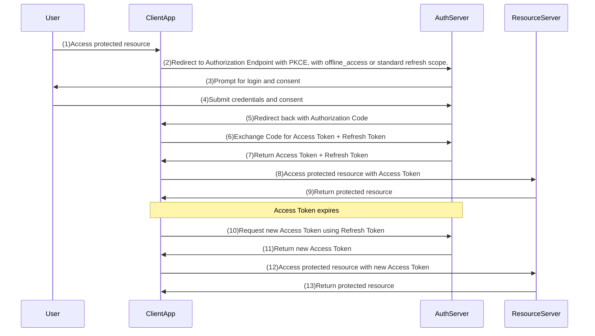

# Refresh Token Grant Flow
 
 This is not a production-ready setup. It is intended for educational purposes to illustrate the OAuth2 Refresh Token Grant Flow.

## Sequence Diagram

*This grant type implementation is not yet completed in oauth2-playbook*.