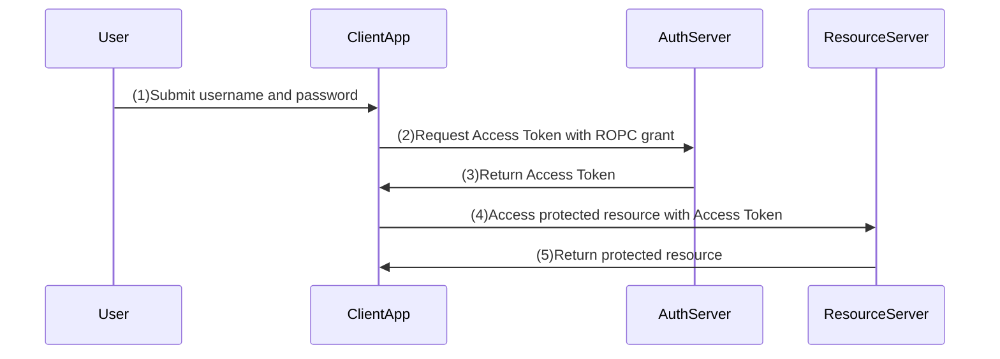

# Resource Owner Password Flow

This is not a production-ready setup. It is intended for educational purposes to illustrate the OAuth2 Resource Owner Password Flow.

## Sequence Diagram

*This grant type implementation is not yet finished in oauth2-playbook*.

## When to use ROPC (Resource Owner Password Credentials) Grant

The Resource Owner Password Credentials (ROPC) grant type is typically used in scenarios where:

- legacy, highly-trusted first-party apps or migrations where no interactive login is possible.
- applications where the resource owner has a high degree of trust in the client application, such as applications developed by the same organization that operates the authorization server.

However, it is generally discouraged for modern applications due to security concerns, as it requires users to share their credentials directly with the client application. More secure alternatives like the Authorization Code Flow with PKCE are recommended for most use cases.